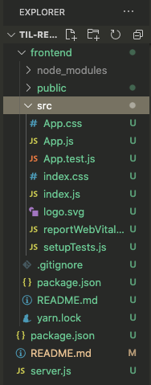
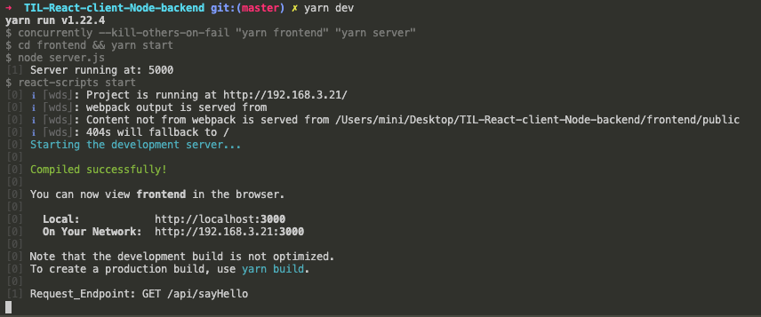

# TIL

**Step-by-Step** for setup an **React** App with **Node.js** Backend

- Create new Repo
- Clone the Repo
- Create package.json

```jsx
npm init
// yarn init
```

_It will ask a couple of questions in order to seed package.json file with some basic information, simply accept the default values with enter, until **(index.js)**, add "server.js" and then enter._

⬇️

```jsx
question name (TIL-React-client-Node-backend):
question version (1.0.0):
question description:
question entry point (index.js): server.js  ▶️ // add this
question repository url (https:...):
question author (...):
question license (MIT):
question private:
success Saved package.json
```

<hr />

## Getting Started ☘️

- Create server.js file inside **Root** directory
- Create React frontend: "frontend" folder in the **Root** directory which contains react frontend

```jsx
npx create-react-app frontend
```

⬇️



- add below to package.json in **Root** directory

```jsx
"frontend": "cd frontend && yarn start"
```

```jsx
yarn frontend
// start frontend server
```

<hr />

## Setup Node.js backend ☘️

1. Create .gitignore file and add file names in order to avoid pushing to Github 🕸

2. Create **Server** ⚙️

- add express, cors

```jsx
yarn add express cors
```

_"express": a Node.js framework_

_"cors": package for providing middleware that can be used to enable CORS_

- In Root package.json should show something like: ⬇️

```jsx
"dependencies": {
		"cors": "^2.8.5",
		"express": "^4.17.1"
	}
```

- Edit server.js content
- Start backend server with

```jsx
node server
```

In Terminal should show below

⬇️

```jsx
TIL-React-client-Node-backend git:(master) ✗ node server
BACK_END_SERVICE_PORT: 5000
```

=> _Navigate to http://localhost:5000 should show_

```jsx
{
"message": "Success"
}
```

<hr />

## Frontend and Backend communication 🎬

- Create controllers folder and controllers.js file

✅ _Controller will respond to the frontend with status "200" and a JSON object_

- Create routes folder and routes.js file

✅ _Create an express router object "router" and a "GET" request route handler to call controller "sayHello"_

- Add api in server.js

```jsx
const api = require('./routes/routes');
app.use('/api/', api);
```

- restart backend server

```jsx
node server
```

_Navigate to http://localhost:5000/api/sayHello and it should show "Hey I am from the server!"_

## Call API from React frontend 🎬

- Add "axios" inside frontend to make HTTP request from Node.js

```jsx
cd frontend && yarn add axios && cd ..
```

- Update App.js file
- Use axios to make GET request to backend api/sayHello and restart frontend server

```jsx
yarn frontend
```

🌤🌤 😳

_Navigate to http://localhost:3000 it shows "Hi I'm from Frontend!" but without any RESPONSE from backend, and inspect that:⬇️ 👀_

```jsx
createError.js:16 Uncaught (in promise) Error: Request failed with status code 404
    at createError (createError.js:16)
    at settle (settle.js:17)
    at XMLHttpRequest.handleLoad (xhr.js:62)
```

=> This is because server running at 5000 but frontend port is 3000, add proxy

⏬

Add to package.json in **frontend** folder

```jsx
"proxy": "http://localhost:5000"
```

=> Restart backend server and frontend server, page should show

```jsx
Hi I'm from Frontend!
Hey I am from the server!
```

☘️☘️☘️
💡 It is also possible to run both server at the same time:

```jsx
yarn add concurrently
```

🔮 update scripts to package.json in **Root** directory:

```jsx
...
"scripts": {
		"server": "node server.js",
		"frontend": "cd frontend && yarn start",
		"dev": "concurrently --kill-others-on-fail \"yarn frontend\" \"yarn server\""
	},
...
```



💫💫💫 That's it!

<hr />

## Deploy to production

### 1. Frontend prepatation 👇

- Add script to package.json in **Root** directory

```jsx
"frontend:build": "cd frontend && yarn build"
```

- Run:

```jsx
yarn frontend:build
```

=> a new directory inside frontend folder "build" appears, remove it from .gitignore file in **frontend** directory

### 2. Deployment with heroku 👇

- Create an account on heroku
- Choose "Create new app" and follow the steps

  - Choose Github as method, search Repo

  - Enable Automatic Deploys

  - Deploy Branch

=> _With "yarn frontend:build" will create a new build each time after changed some code before push them to Github_

That's it ! Now it's possible to browse the app URL given by heroku! 🏵 🌟

<hr />

## Additional: 🧚‍♀️

Added form and send input value to server using axios, to avoid empty body error, add "body-parser"

```jsx
yarn add body-parser

// in order to read HTTP POST data, use "body-parser" node module, it is a piece of express middleware that reads a form's input and stores it as a javascript object accessible through req.body
```
